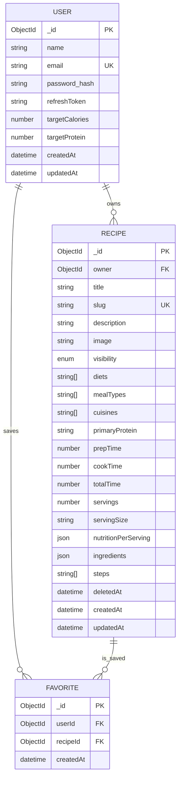

# BarbellBites Architecture Doc

## Purpose
This document defines the MVP technical architecture for BarbellBites (gym-focused recipe app) across backend and frontend.

## System Overview
- Frontend: React + Vite + TypeScript SPA.
- Backend: Express + TypeScript REST API.
- Database: MongoDB via Mongoose.
- Auth: JWT access token + refresh token cookie flow.

## Architecture Principles
- Keep MVP scope narrow and shippable.
- Use clear layering: route -> controller -> service -> model.
- Keep server-state and UI-state separated in frontend.
- Prefer explicit, predictable API contracts.

## Backend Architecture
### Current modules
- `src/router` for route definitions.
- `src/controllers` for request/response handling.
- `src/services` for business logic.
- `src/models` for Mongoose schemas.
- `src/middleware` for auth/validation/error handling.
- `src/utils` for token/cookie/helpers.

### MVP domain modules to add
- Recipe module: model, requests, routes, controller, service.
- Favorite module: model, requests, routes, controller, service.
- User goals/profile module updates (`targetCalories`, `targetProtein`).

### Data model (MVP)
- User: identity/auth + goals (`targetCalories`, `targetProtein`).
- Recipe: ownership, metadata (`diets`, `mealTypes`, `cuisines`, `primaryProtein`), prep/cook timing, serving metadata, ingredients, steps, and `nutritionPerServing`.
- Favorite: userId + recipeId unique pair.
- Soft-delete support on recipes via `deletedAt`.

### ERD (Target State)

    
## Frontend Architecture
### App layers
- Routing layer: page navigation and protected routes.
- API layer: centralized HTTP client + feature API files.
- Server-state layer: React Query (fetching/caching/mutations).
- Global client-state layer: Zustand (auth/session/UI global state).
- UI layer: pages/components/forms.

### Planned page structure
- Auth: Login/Register.
- Recipes: Browse, Detail, My Recipes, Create/Edit.
- User: Favorites, Profile/Goals.

### State strategy
- React Query: recipes/favorites/profile-goals data from API.
- Zustand: auth user/session flags and global UI state.
- Local component state: form-specific transient state.

## Security and Auth
- Access token for protected API calls.
- Refresh token stored in httpOnly cookie.
- Backend `protect` middleware for private endpoints.
- Ownership checks for editing/deleting user-owned resources.

## Environments and Configuration
- Backend `.env`: Mongo, JWT secrets, expiry, port, node env.
- Frontend env (`VITE_*`): API base URL and runtime config.
- CORS should allow frontend origin + credentials for cookie auth.

## Delivery Phases
1. Foundation alignment (goals, auth/profile consistency, CORS credentials).
2. Recipe core (CRUD + browse/search/filter).
3. Favorites.
4. Hardening and release checks.

## Non-Goals (MVP)
- Ratings/comments/social feed.
- Advanced analytics dashboards.
- Complex recommendation engine.
- Large external food integrations.
