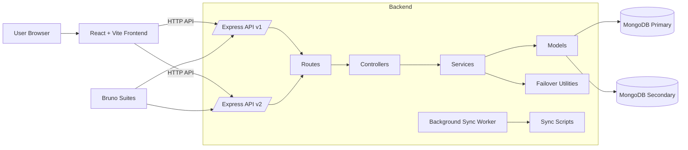
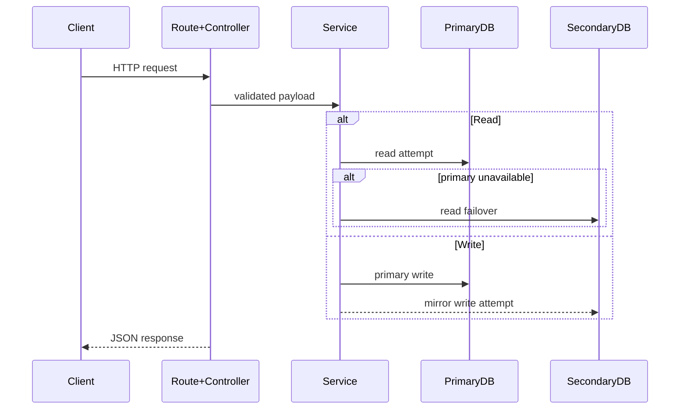

# ArchitectureDoc

System-level design for BarbellBites, including component boundaries, request flow, and dual-cluster data behavior.

## RelatedDocuments

- [ApiDocumentation](./ApiDocumentation.md)
- [DatabaseSchema](./DatabaseSchema.md)
- [EnvironmentConfigurationGuide](./EnvironmentConfigurationGuide.md)
- [SecurityGuide](./SecurityGuide.md)
- [TroubleshootingFaq](./TroubleshootingFaq.md)

## SystemOverview

```text
BarbellBites/
  backend/
    src/
      routes/         # Versioned API routing (v1, v2)
      controllers/    # HTTP handlers
      services/       # Business logic + failover behavior
      models/         # Mongoose models for primary + secondary
      middleware/     # Auth, validation, ownership, error handling
      scripts/        # Migration, seed, sync, Bruno runner
      jobs/           # Background sync worker
      utils/          # Tokens, cookies, failover, custom errors
  frontend/
    src/
      api/            # Axios client and endpoint adapters
      pages/          # Route-level UI
      components/     # Reusable UI
      layouts/        # App shells
      router/         # Route configuration
      store/          # Auth state
  docs/
```

## ComponentRelationships



## DataFlow



## BackendLayout

- `backend/src/routes/v1`, `backend/src/routes/v2`: versioned APIs
- `backend/src/controllers/v1`, `backend/src/controllers/v2`: endpoint handlers
- `backend/src/services/v1`, `backend/src/services/v2`: business logic
- `backend/src/models/v1`, `backend/src/models/v2`: connection-bound models
- `backend/src/scripts/`: migration/seed/sync/test scripts
- `backend/src/jobs/syncWorker.ts`: periodic reconciliation job

## FrontendLayout

- `frontend/src/router/`: app route mapping
- `frontend/src/pages/`: page-level composition
- `frontend/src/layouts/`: shared shells
- `frontend/src/api/`: HTTP integration
- `frontend/src/store/authStore.ts`: authentication state
