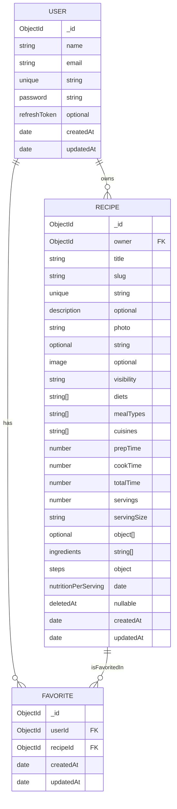

# DatabaseSchema

MongoDB schema reference for BarbellBites (applies to both `v1` and `v2` model directories).

## RelatedDocuments

- [ArchitectureDoc](./ArchitectureDoc.md)
- [ApiDocumentation](./ApiDocumentation.md)
- [EnvironmentConfigurationGuide](./EnvironmentConfigurationGuide.md)
- [TroubleshootingFaq](./TroubleshootingFaq.md)

## EntityRelationshipDiagram

## CollectionDefinitions

### UserCollection

Source: `backend/src/models/v2/User.ts`

- `name`: required string
- `email`: required, unique, lowercase, trimmed
- `password`: required, min length 8, excluded from default select
- `refreshToken`: optional string
- Hooks:
- pre-save password hashing with `bcryptjs`

### RecipeCollection

Source: `backend/src/models/v2/Recipe.ts`

- `owner`: `ObjectId` reference to `User`, indexed
- `slug`: required, unique, lowercase, indexed
- `visibility`: enum `private | public | unlisted`
- `diets`, `mealTypes`, `cuisines`: string arrays constrained by taxonomy constants
- `ingredients`: required embedded array (`name`, `amount`, optional `unit`)
- `steps`: required string array
- `nutritionPerServing`: required embedded object (`calories`, `protein`, `carbs`, `fats`)
- `deletedAt`: nullable date for soft delete, indexed
- Hooks:
- pre-validate slug generation from title
- pre-save `totalTime` auto-calculation when zero

### FavoriteCollection

Source: `backend/src/models/v2/Favorite.ts`

- `userId`: `ObjectId` reference to `User`, indexed
- `recipeId`: `ObjectId` reference to `Recipe`, indexed
- Compound unique index: `{ userId: 1, recipeId: 1 }`

## RelationshipRules

- A `User` can own many `Recipe` documents.
- A `User` can favorite many recipes through `Favorite`.
- A recipe can be favorited by many users through `Favorite`.
- Duplicate favorites for the same `(userId, recipeId)` pair are blocked by unique index.

## DataLifecycleNotes

- Soft deletion is implemented via `Recipe.deletedAt`.
- Read operations may fail over to backup cluster.
- Write operations are primary-first with mirror attempts to backup.
