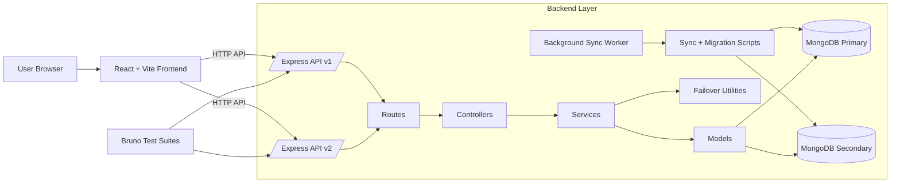

# Architecture

This document summarizes the BarbellBites project structure, system architecture, and folder layout.

## Project Structure

```text
BarbellBites/
  backend/
    src/
      config/
      constants/
      controllers/
      jobs/
      middleware/
      migrations/
      models/
      requests/
      routes/
      scripts/
      services/
      utils/
    BarbellBites/          # Bruno collections and suites
    package.json
  frontend/
    src/
      api/
      components/
      hooks/
      layouts/
      pages/
      resources/
      router/
      services/
      store/
    package.json
  docs/
    backend/
    frontend/
    architecture.md
    dependencies.md
  README.md
```

## System Architecture (Mermaid)



## Backend Layout

- `src/config/`: DB configuration and connection handling
- `src/routes/v1`, `src/routes/v2`: versioned route modules
- `src/controllers/v1`, `src/controllers/v2`: request handlers
- `src/services/v1`, `src/services/v2`: business logic and failover behavior
- `src/models/v1`, `src/models/v2`: connection-bound Mongoose models
- `src/scripts/`: migrations, seed, sync, test runner scripts
- `src/jobs/`: background sync worker
- `src/utils/`: shared helpers (tokens, failover, errors)
- `BarbellBites/`: Bruno collections (`V1` and `V2` smoke/edge)

## Frontend Layout

- `src/router/`: route definitions
- `src/pages/`: page-level views
- `src/layouts/`: layout wrappers
- `src/components/`: reusable UI components
- `src/api/`: API adapters and HTTP client setup
- `src/store/`: global client state (auth)
- `src/hooks/`: reusable custom hooks
- `src/resources/`: design tokens (colors, shadows, typography)
- `src/services/`: app-level utilities (notifications)

## Data and Sync Topology

- Primary + secondary MongoDB clusters are both configured.
- Reads can fail over from primary to secondary for connectivity errors.
- Writes are primary-first with backup mirror attempts.
- Manual sync scripts support both directions (`p2s`, `s2p`).
- Background worker can run scheduled sync cycles.
